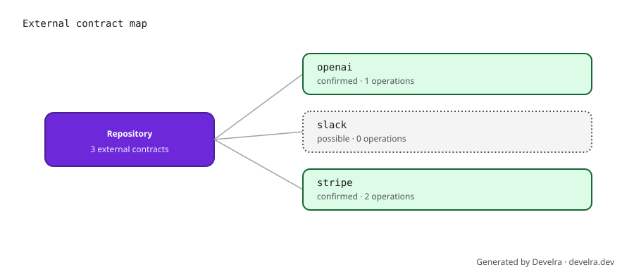

# Develra

**A lockfile for every external contract your code depends on.**

Develra is an open-source, local-first scanner for external APIs, SDKs,
endpoints, outbound webhooks, and project-level MCP servers. It turns static
repository evidence into a deterministic `develra.lock` that can be reviewed
and enforced in CI.

```bash
npx develra scan
git add develra.lock
```

No account, API key, daemon, or network connection is required. Develra does
not execute repository code, install its dependencies, or start MCP servers.

## What it finds

```text
Develra scanned 3 files

External contracts: 5

CONFIRMED  OpenAI
           package openai@5.4.0
           operation responses.create
           files package.json, src/contracts.ts

POSSIBLE   Slack
           package @slack/web-api@7.9.2
           files package.json

CONFIRMED  Stripe
           package stripe@18.2.1
           operation checkout.sessions.create
           operation payment_intents.create
           files package.json, src/contracts.ts, src/endpoints.ts

UNKNOWN    hooks.partner-events.com
           host in src/endpoints.ts
```



Develra combines package manifests and lockfiles with syntax-aware imports,
constructor bindings, SDK method calls, raw HTTP endpoints, configured API
versions, webhook-like URL configuration, and MCP JSON. Confidence has a
deliberately simple meaning:

- `confirmed`: an operation, known endpoint, or static MCP server is present;
- `probable`: a provider package is installed and imported;
- `possible`: only a package or lower-strength URL signal was found;
- `unknown`: an external host was found but no provider pack matched it.

## Use the lockfile

`scan` writes `develra.lock` atomically. The lockfile is sorted, contains only
repository-relative paths, and has no timestamp or machine-specific metadata.
Repeated scans of unchanged inputs produce identical bytes.

```bash
# Create or refresh the inventory
npx develra scan

# Verify the committed inventory
npx develra check

# Generate optional review artifacts
npx develra scan --report develra-report.md --graph develra-graph.svg
npx develra scan --json - --no-write

# Inspect the installation and bundled provider catalog
npx develra doctor
npx develra providers list
```

By default, `check` fails on changed findings at `probable` confidence or
higher. Set policy in `develra.config.yaml`:

```yaml
version: 1
policy:
  fail_on: probable
  fail_on_changes:
    - any
reporters:
  markdown: develra-report.md
  sarif: develra.sarif
```

The complete [CLI contract](docs/03-cli-contract.md), [lockfile
format](docs/04-lockfile-schema.md), and [example configuration](examples/develra.config.yaml)
are committed with the project.

## GitHub Action

Commit the generated lockfile, then add:

```yaml
name: Develra

on:
  pull_request:
  push:
    branches: [main]

permissions:
  contents: read

jobs:
  contracts:
    runs-on: ubuntu-latest
    steps:
      - uses: actions/checkout@v6
      - uses: develra-dev/develra@v0
        with:
          command: check
          fail-on: probable
```

The Action is a checked-in Node bundle: it does not run `npm install` or call a
hosted Develra service. It writes a job summary and exposes Markdown and SARIF
paths for later workflow steps. See the [Action reference](docs/07-github-action.md).

## Supported inputs

The first release supports:

- JavaScript and TypeScript (`package.json`, npm and pnpm lockfiles, ESM,
  CommonJS, SDK calls, `fetch`, Axios, Got, and Ky);
- Python (`pyproject.toml`, requirements and Pipfile manifests, imports, SDK
  calls, and Requests-style endpoints);
- static project-level MCP JSON configurations;
- ten bundled provider packs: Anthropic, Clerk, GitHub, OpenAI, Resend,
  Shopify, Slack, Stripe, Supabase, and Twilio.

Detection stays conservative. It does not evaluate variables, execute dynamic
imports, inspect runtime traffic, resolve Python lockfiles yet, or claim a
specific provider for an unknown custom domain. Recoverable parse and scan
limits are reported as diagnostics instead of silently inventing certainty.

## Privacy and safety

Develra's default scan is offline and telemetry-free. Secret-bearing files are
excluded, symlinks cannot escape the scan root, output paths must remain inside
that root, and MCP arguments, environment values, URL paths, and query strings
are discarded. Lockfiles store normalized contract facts and evidence paths,
never source snippets or credential values.

## Provider packs

Provider knowledge is declarative YAML, not hard-coded detection logic. Start
from [`packages/providers/data/_template.yaml`](packages/providers/data/_template.yaml),
then validate a file or directory locally:

```bash
npx develra providers validate ./packages/providers/data/acme.yaml
```

Read the [provider-pack specification](docs/05-provider-pack-spec.md) before
contributing matchers. New operations should include safe positive, alias, and
negative fixtures.

## Breakage Museum

The [Breakage Museum](examples/breakage-museum/) is a synthetic, executable
corpus of representative OpenAPI and MCP contract changes: removed response
fields, newly required request fields, response enum expansion, removed
operations, and stricter MCP tool inputs. It provides regression data for
future explicit upstream-change work without claiming that the current local
scanner monitors vendors.

```bash
pnpm test:fixtures
```

## Development

Requires Node.js 22 or newer and pnpm 10.

```bash
pnpm install --frozen-lockfile
pnpm verify
```

`pnpm verify` formats and type-checks the workspace, runs unit, fixture, CLI,
and Action tests, rebuilds the committed Action bundle, and installs the packed
CLI into a temporary project for an offline smoke test.

The static project website can be reviewed locally without installing another
toolchain:

```bash
pnpm site:validate
pnpm site:preview
```

The checked-in Vercel configuration validates and deploys only `site/`. See the
[website notes](docs/15-website.md) for preview and launch boundaries.

Maintainer-ready launch copy and the reproducible terminal recording source are
collected in [the launch artifacts](docs/16-launch-artifacts.md).

See [CONTRIBUTING.md](CONTRIBUTING.md), [SECURITY.md](SECURITY.md), and the
[implementation roadmap](docs/11-implementation-tickets.md). Maintainers use
the owner-controlled [release checklist](docs/14-release-checklist.md); no
workflow publishes automatically.

## License

Apache-2.0. See [LICENSE](LICENSE).
